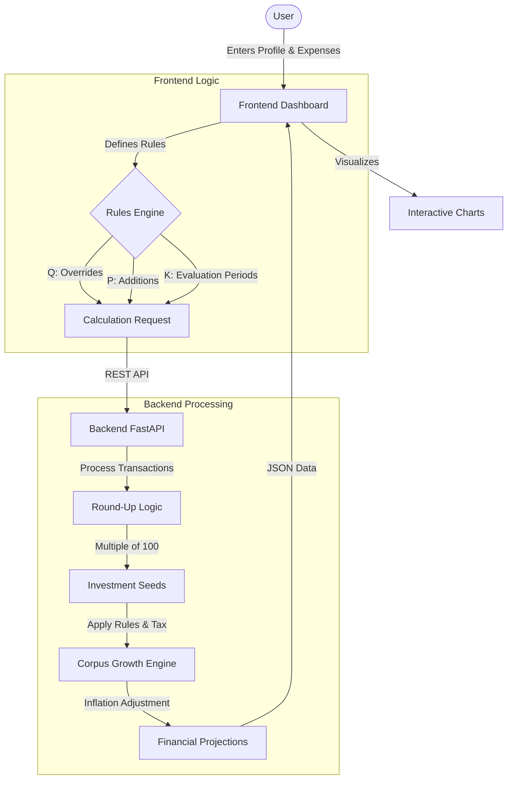

# Smart Retirement Saver (Monorepo)

A comprehensive automated micro-savings and retirement projection system built for the Blackrock Hackathon.

## Project Structure

This project is organized as a monorepo:

- **[backend/](file:///media/kondekar/Shubham/hackathons/Blackrock%20Hackathon/backend)**: Python (FastAPI) service for financial calculations, rules engine, and task queue (Celery/Redis).
- **[frontend/](file:///media/kondekar/Shubham/hackathons/Blackrock%20Hackathon/frontend)**: React (TypeScript) dashboard for interactive visualization and simulation.

## System Flow



## Quick Start

### 1. Prerequisite
Ensure you have **Docker** and **Node.js** installed.

### 2. Run Backend
```bash
cd backend
docker compose up --build
```
The API will be available at `http://localhost:5477`.

### 3. Run Frontend
```bash
cd frontend
npm install
npm run dev
```
The dashboard will be available at `http://localhost:3000`.

## Key Features
- **Monorepo Design**: Clean separation of concerns with unified project management.
- **Automated Round-ups**: Precision financial logic using `Decimal` for frictionless savings.
- **Real-time Projections**: Interactive charts for NPS and Index Fund growth with inflation adjustment.
- **Scalable Architecture**: Background task processing for heavy calculations.
- **Premium UI**: Modern dark-mode dashboard with Glassmorphism.
- **Mobile Friendly**: Fully responsive design for seamless use on any device (Phones, Tablets, Desktop).

### ⭐ Live Deployments
- **Frontend**: https://kondekarshubham123.github.io/Smart-Retirement-Saver/
- **Backend API docs**: https://smart-retirement-saver.onrender.com/blackrock/challenge/v1/docs

> [!IMPORTANT]
> **Async APIs & Live Deployment**:
> The following async endpoints will **not** work on the live Render environment (https://smart-retirement-saver.onrender.com/) because only the API container is deployed for load testing (without the Celery worker/Redis stack):
> - `/blackrock/challenge/v1/returns:nps_async`
> - `/blackrock/challenge/v1/returns:index_async`
> - `/blackrock/challenge/v1/returns/status/{task_id}`
>
> **Evaluators**: Please run the application locally using the `compose.yaml` file to test these asynchronous features.

## Documentation
- [Backend README](backend/README.md)
- [Frontend README](frontend/README.md)
> **Note:** the public API deployment (https://smart-retirement-saver.onrender.com/) is
> running on Render's free plan and will automatically sleep after about one minute of
> inactivity.  If the UI at the GitHub Pages link appears unresponsive, start the backend
> manually or wake the service via the Render dashboard before retrying.
